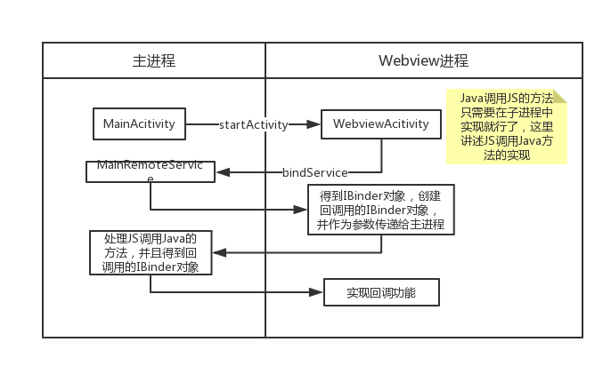

# WebviewComponent

Webview 组件

# 图解



# 参考文章

- [android web模块独立进程的实现](https://blog.csdn.net/u010577768/article/details/80423064)

# 一些知识点

```java
/**
 * Dom Storage（Web Storage）存储机制：
 * 优势：较大存储空间，使用简单。
 * 使用场景：临时、简单数据的缓存，Cookies的扩展。
 */
webSettings.setDomStorageEnabled(true);
/**
 * Web SQL Database 存储机制：
 * 优势：存储、管理复杂结构数据。
 * 使用场景：用IndexDB替代，不推荐使用。
 * 这里是为了兼容性
 */
webSettings.setDatabaseEnabled(true);
final String dbPath = context.getDir("db", Context.MODE_PRIVATE).getPath();
webSettings.setDatabasePath(dbPath);
/**
 * Application Cache 存储机制
 * 优势：方便构建离线APP。
 * 使用场景：离线APP、静态文件缓存，不推荐使用。
 * 这里是为了兼容性
 */
webSettings.setAppCacheEnabled(true);
final String cachePath = context.getDir("cache",Context.MODE_PRIVATE).getPath();
webSettings.setAppCachePath(cachePath);
webSettings.setAppCacheMaxSize(5*1024*1024);
/**
 * Indexed Database 存储机制
 * 优势：存储任何类型数据、使用简单，支持索引。
 * 使用场景：结构、关系复杂的数据存储，Web SQL Database的替代
 * Android 在4.4开始加入对 IndexedDB 的支持，只需打开允许 JS 执行的开关就好了。
 */
webSettings.setJavaScriptEnabled(true);
```